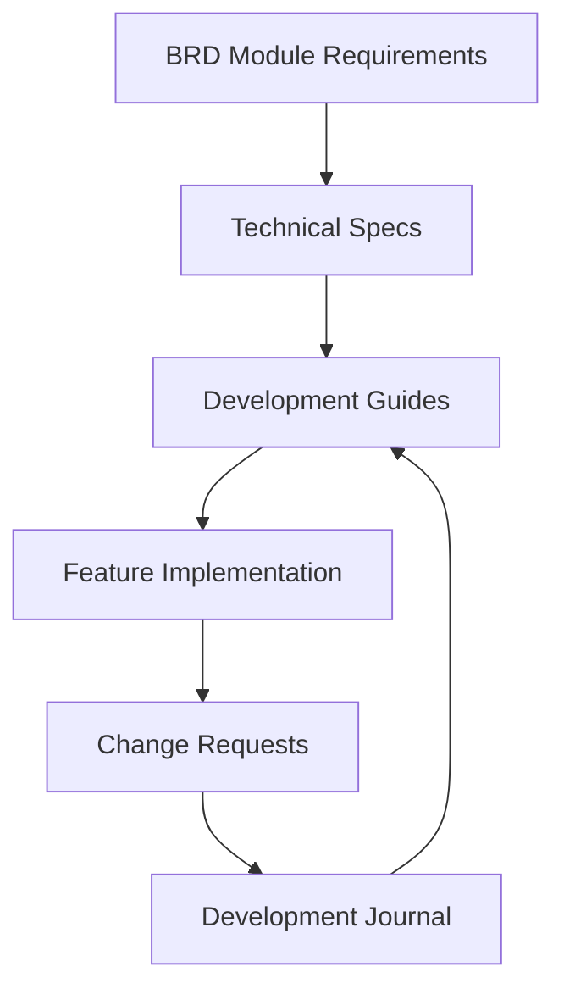

# Documentation Structure

## Current Directory Structure
```
docs/
├── brd/                           # Business Requirements Documentation
│   ├── modules/                   # Module-specific requirements
│   │   └── contact_management/    # Contact Management Module
│   │       ├── README.md         # Module overview
│   │       ├── requirements/     # Business Requirements
│   │       └── technical/       # Technical Specifications
│   └── README.md                  # BRD overview and guidelines
│
├── guides/                        # Development Guidelines
│   ├── quick-start/              # Daily essentials
│   │   ├── SETUP.md             # First-time setup
│   │   ├── COMMANDS.md          # Common commands
│   │   └── WORKFLOW.md          # Daily workflow
│   └── detailed/                # In-depth documentation
│       ├── DEVELOPMENT.md       # Technical details
│       ├── PROJECT.md           # Project management
│       ├── TESTING.md          # Testing strategy
│       └── cr/                 # Change Request process
│
├── features/                     # Feature documentation
│   ├── 1-data-model/           # First milestone
│   └── 2-service-layer/        # Second milestone
│
├── dev-journal/                 # Development journals
│   ├── sprint-YYYY-MM/         # Sprint journals
│   └── future-YYYY-QN/         # Future planning
│
└── environment/                 # Environment Configuration

```

## Documentation Flow

### 1. Requirements to Implementation Flow



1. **Business Requirements** (`brd/modules/{module}/requirements/`)
   - Functional requirements
   - Non-functional requirements
   - User stories and scenarios
   - Module-specific constraints

2. **Technical Specifications** (`brd/modules/{module}/technical/`)
   - System architecture
   - Data models
   - Interface definitions
   - Technical constraints

3. **Development Guidelines** (`guides/`)
   - How we build things
   - Coding standards
   - Process templates

4. **Feature Implementation** (`features/`)
   - Concrete technical solutions
   - Code patterns and examples
   - Technical decisions

5. **Environment Setup** (`environment/`)
   - Where and how we run things
   - Configuration details
   - Maintenance procedures

6. **Current Progress** (`dev-journal/`)
   - Track current sprint focus and progress
   - Document key technical decisions and rationale
   - Record pattern discoveries and improvements
   - Fine-granular backlog management alongside GitHub tools
   - Version-controlled history of implementation evolution

### 2. Document Types and Usage

#### Business Requirements (High Level)
- Feature specifications
- Process definitions
- Business rules
- Update frequency: Medium (with business needs)

#### Development Guidelines (Framework Level)
- Coding standards
- Process guides
- Templates
- Update frequency: Low (with major process changes)

#### Implementation Details (Technical Level)
- Code patterns
- Technical decisions
- Best practices
- Update frequency: Medium (with pattern discoveries)

#### Change Requests (Historical Record)
- Implementation decisions
- Pattern evolution
- Problem-solution documentation
- Update frequency: High (with each change)

#### Development Journal (Progress Tracking)
- Current sprint focus and goals
- Key technical decisions and their context
- Pattern discoveries and improvements
- Fine-granular backlog management alongside GitHub Project Board and Issue Tracker
- Update frequency: Multiple times per day as work progresses

### 3. When to Use What

#### Starting New Work
1. Check module requirements in `brd/modules/{module}/requirements/`
2. Review technical specs in `brd/modules/{module}/technical/`
3. Follow development guides
4. Reference implementation patterns
5. Document changes in CR

#### Implementing Features
1. Reference BRD for requirements
2. Use templates from development guides
3. Follow implementation patterns
4. Document decisions in CR

#### Making Technical Decisions
1. Review existing patterns
2. Check related CRs
3. Update implementation docs
4. Create new CR

### 4. Documentation Maintenance

#### Review Levels
1. **Business Requirements**
   - Review with stakeholders
   - Update with business changes
   - Maintain traceability to implementation

2. **Development Guidelines**
   - Team review for process changes
   - Update templates as needed
   - Keep standards current

3. **Implementation Details**
   - Technical team review
   - Pattern validation
   - Regular updates with discoveries

4. **Change Requests**
   - Peer review
   - Never modify after approval
   - Link to affected documents

5. **Development Journal**
   - Sprint progress and focus areas
   - Technical decisions and rationale
   - Pattern discoveries and improvements
   - Fine-granular backlog management alongside GitHub Project Board and Issue Tracker
   - Update frequency: Multiple times per day (tracks active development)

## Contributing

### 1. Choosing Location
- Business requirements → `brd/modules/`
- Process documentation → `guides/`
- Feature documentation → `features/`
- Progress tracking → `dev-journal/`
- Environment setup → `environment/`

### 2. Using Templates
- Start with template from `templates/`
- Follow structure for document type
- Include all required sections

### 3. Cross-Referencing
- Link to related documents
- Update parent documents
- Maintain documentation map

### 4. Review Process
1. Use appropriate template
2. Follow section guidelines
3. Update related documents
4. Get peer review
5. Update this README if needed

## Aspirational Structure

The following elements are planned but not yet implemented:

### Planned Directories
```
docs/
├── features/
│   └── patterns/         # [PLANNED] Reusable development patterns
│
├── environment/
│   ├── setup/           # [PLANNED] Environment setup guides
│   └── maintenance/     # [PLANNED] Maintenance procedures
```

### Planned Documentation
1. **Development Patterns**
   - Common solution patterns
   - Architecture decision records
   - Cross-cutting concerns

2. **Environment Documentation**
   - Setup automation scripts
   - Maintenance procedures
   - Monitoring guidelines

3. **Testing Documentation**
   - Test data management
   - Performance test guidelines
   - Security test patterns
