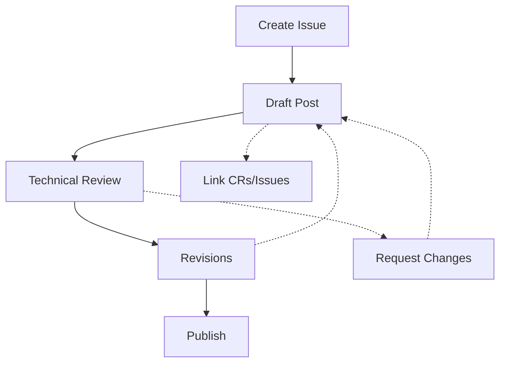

# Development Experience Blog Process

This directory contains blog posts documenting our development experiences, technical insights, and process improvements. The goal is to capture learning moments and share knowledge while maintaining traceability to the actual implementation work.

## Directory Structure

```plaintext
blog/
├── drafts/              # Work in progress posts
├── published/           # Finalized and reviewed posts
└── templates/           # Post templates and guidelines
    └── blog-post.md     # Standard post template
```

## Blog Post Workflow



### 1. Issue Creation
- Use the blog post issue template
- Label with `blog` and relevant categories
- Link to related implementation issues/CRs
- Define target audience and scope

### 2. Content Development
- Create draft in `drafts/YYYY-MM-DD-title.md`
- Follow template structure
- Include relevant code examples
- Add mermaid diagrams where helpful
- Link to implementation details

### 3. Review Process
- Technical accuracy review
- Process accuracy review
- Writing quality review
- Verify all links and references

### 4. Publication
- Move to `published/` directory
- Update issue status
- Cross-reference in related CRs/issues

## Post Categories

1. **Technical Deep Dives**
   - Implementation details
   - Architecture decisions
   - Technical challenges
   - Solution comparisons

2. **Process Reviews**
   - Workflow improvements
   - Tool evaluations
   - Methodology adjustments
   - Team collaboration

3. **Lessons Learned**
   - Challenge retrospectives
   - Success analysis
   - Improvement opportunities
   - Best practices discovered

## Content Guidelines

### Writing Style
- Professional but engaging
- Clear and concise
- Code examples where relevant
- Visual aids (diagrams, charts)

### Required Elements
- Context and background
- Technical details (when applicable)
- Lessons learned
- Next steps or improvements
- Links to related documentation

### Metadata
- Title and author
- Date and status
- Related issues and CRs
- Relevant tags

## Review Checklist

- [ ] Follows template structure
- [ ] Contains required metadata
- [ ] Links are valid and accessible
- [ ] Code examples are accurate
- [ ] Diagrams are clear and helpful
- [ ] Technical details are accurate
- [ ] Process descriptions are current
- [ ] Lessons learned are actionable
- [ ] Writing is clear and professional

## Best Practices

1. **Timing**
   - Create issues during/after significant implementations
   - Draft while context is fresh
   - Regular review cycles

2. **Content**
   - Focus on unique insights
   - Include concrete examples
   - Provide actionable takeaways
   - Maintain professional tone

3. **Integration**
   - Link to specific commits/PRs
   - Reference technical decisions
   - Include process impacts
   - Consider future implications

## Using Templates

1. **Blog Post Template**
   - Copy from `templates/blog-post.md`
   - Fill in all metadata fields
   - Follow section guidelines
   - Include all required elements

2. **Issue Template**
   - Use GitHub issue template
   - Complete all sections
   - Add relevant labels
   - Assign reviewers

## Maintenance

- Regular review of published posts
- Update outdated technical information
- Archive obsolete content
- Maintain index of posts

---

*Last Updated: {DATE}*
