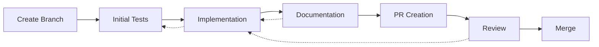
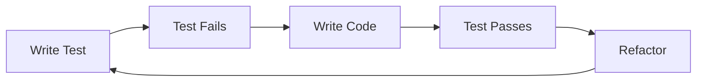
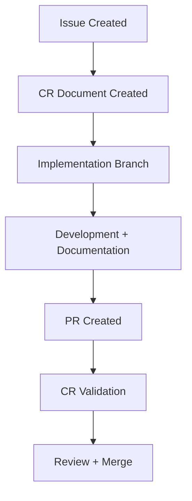

# Development Process and Documentation Strategy: A Domain-Driven Approach

## Context
Our project implements a systematic approach to software development, emphasizing domain-driven design, test-driven development, and comprehensive documentation. This post outlines our development workflow and explains the rationale behind our key process decisions.

## Key Insights
- Domain-driven design with clear separation of concerns drives our architecture
- Test-driven development ensures quality at every layer
- Systematic change tracking through CRs maintains project clarity
- Documentation is an integral part of the development process
- Automated validation ensures process compliance

## Technical Details

### Branching Strategy


Our branch naming follows a clear convention:
- `feature/XX-description` - New features
- `fix/XX-description` - Bug fixes
- `docs/XX-description` - Documentation updates
- `refactor/XX-description` - Code refactoring

### Test-Driven Development


### Change Request Lifecycle


### Documentation Structure
```plaintext
├── docs/
│   ├── implementation/
│   │   ├── PHASES.md
│   │   ├── changes/
│   │   │   └── CR-YYYY.MM-XX/
│   │   └── IMPLEMENTATION_PLAN.md
│   └── development/
│       └── DEVELOPMENT_JOURNAL.md
```

## Process Improvements
1. **Systematic Change Management**
   - Structured CR documentation
   - Clear validation requirements
   - Automated checks
   - Version tracking

2. **Documentation Integration**
   - Documentation as part of TDD cycle
   - Real-time updates
   - Cross-referencing
   - Automated validation

3. **Quality Assurance**
   - >80% test coverage requirement
   - Automated validation workflows
   - Documentation quality checks
   - Performance benchmarking

## Lessons Learned
1. Documentation must be an integral part of the development process, not an afterthought
2. Automated validation ensures process compliance without adding manual overhead
3. Clear separation of concerns in documentation mirrors our domain-driven approach
4. Regular documentation updates prevent knowledge loss and maintain project clarity

## Next Steps
1. Enhance automated validation
2. Implement documentation analytics
3. Develop metrics for process effectiveness
4. Create tooling for documentation maintenance

## Related Documentation
- Link to CR-2024.02-23 for timezone implementation
- Implementation Plan updates
- Development Journal entries
- Quality metrics documentation

---
*Last Updated: 2024-02-17*
