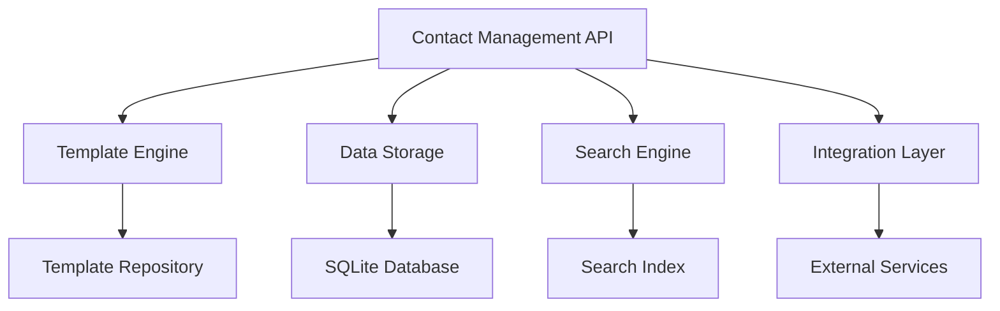
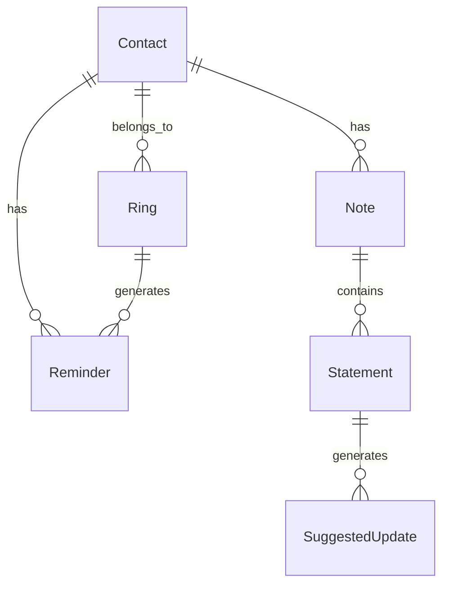
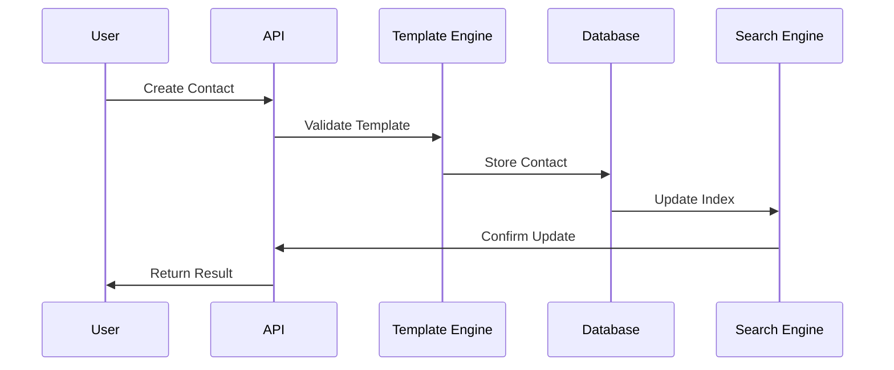

# Technical Architecture - Contact Management

## 1. System Architecture

### 1.1 Component Overview


### 1.2 Key Components

1. **Contact Management API**
   - RESTful endpoints
   - GraphQL interface
   - WebSocket notifications
   - Authentication middleware

2. **Template Engine**
   - Template validation
   - Version management
   - Migration tools
   - Custom field types

3. **Data Storage**
   - SQLite with JSON support
   - ACID compliance
   - Optimized queries
   - Caching layer

4. **Search Engine**
   - Full-text search
   - Tag-based search
   - Fuzzy matching
   - Result ranking

5. **Integration Layer**
   - Service adapters
   - Protocol handlers
   - Data transformers
   - Event system

## 2. Data Architecture

### 2.1 Core Entities


### 2.2 Data Flow


## 3. Implementation Details

### 3.1 Contact Model
```python
class Contact(BaseModel):
    id: UUID
    name: str
    first_name: Optional[str]
    sub_information: Dict[str, Any]
    hashtags: List[str]
    briefing_text: Optional[str]
    last_met: Optional[datetime]
    created_at: datetime
    updated_at: datetime
```

### 3.2 Template Model
```python
class Template(BaseModel):
    categories: Dict[str, CategoryDefinition]
    updated_at: datetime
```

### 3.3 Category Definition
```python
class CategoryDefinition(BaseModel):
    fields: Dict[str, FieldDefinition]
```

### 3.4 Field Definition
```python
class FieldDefinition(BaseModel):
    type: str  # string, number, date, boolean
    description: str
    validators: Optional[List[str]] = None
```

## 4. API Design

### 4.1 REST Endpoints
```plaintext
POST   /api/contacts              # Create contact
GET    /api/contacts/{id}         # Get contact
PUT    /api/contacts/{id}         # Update contact
DELETE /api/contacts/{id}         # Delete contact
GET    /api/contacts/search       # Search contacts
GET    /api/template             # Get template
PUT    /api/template             # Update template
```

### 4.2 GraphQL Schema
```
