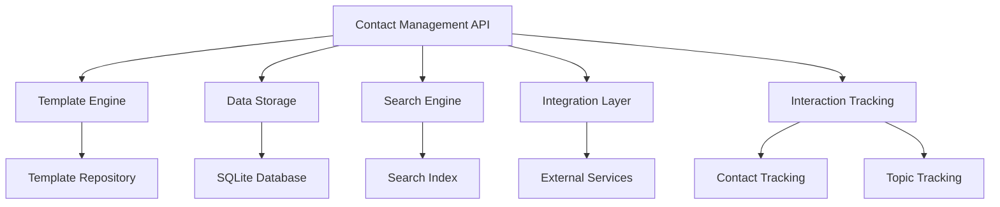
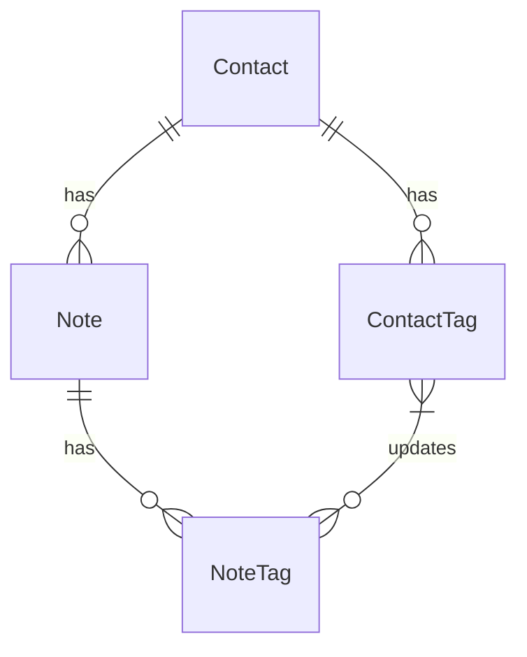
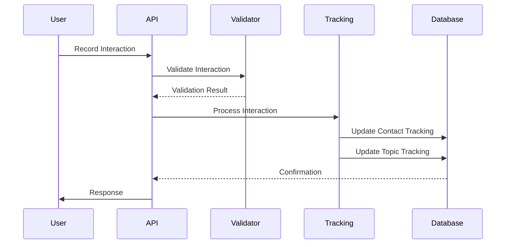
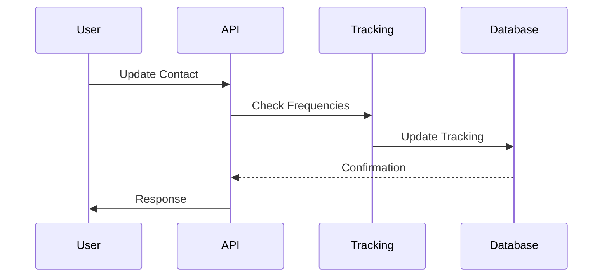

# Technical Architecture - Contact Management

## 1. System Architecture

### 1.1 Component Overview


### 1.2 Key Components

1. **Contact Management API**
   - RESTful endpoints
   - GraphQL interface
   - WebSocket notifications
   - Authentication middleware
   - Interaction validation

2. **Template Engine**
   - Template validation
   - Version management
   - Migration tools
   - Custom field types

3. **Data Storage**
   - SQLite with JSON support
   - ACID compliance
   - Optimized queries
   - Caching layer

4. **Search Engine**
   - Full-text search
   - Tag-based search
   - Interaction history search
   - Contact staleness search

5. **Integration Layer**
   - Service adapters
   - Protocol handlers
   - Data transformers
   - Event system

6. **Interaction Tracking**
   - Two-level tracking:
     - Contact level
     - Topic level (tags)
   - Frequency monitoring
   - Staleness calculation
   - Interaction validation

## 2. Data Architecture

### 2.1 Core Entities


### 2.2 Data Flow

#### 2.2.1 Interaction Recording Flow


#### 2.2.2 Contact Update Flow


## 3. Implementation Details

### 3.0 Timezone Handling
```python
# All datetime fields are stored in UTC and handled consistently across layers
class TimezoneAwareBase:
    """Base functionality for timezone handling across all models."""
    @staticmethod
    def ensure_timezone(dt: Optional[datetime]) -> Optional[datetime]:
        """Ensures datetime is timezone-aware in UTC."""
        if dt is None:
            return None
        if dt.tzinfo is None:
            return dt.replace(tzinfo=timezone.utc)
        return dt.astimezone(timezone.utc)
```

### 3.1 Contact Model
```python
class Contact(BaseModel):
    id: UUID
    name: str
    first_name: Optional[str]
    sub_information: Dict[str, Any]
    tags: List[ContactTag]
    last_interaction_at: Optional[datetime]  # Always in UTC
    created_at: datetime  # Always in UTC
    updated_at: datetime  # Always in UTC

    def __init__(self, **data):
        super().__init__(**data)
        self.last_interaction_at = self.ensure_timezone(self.last_interaction_at)
        self.created_at = self.ensure_timezone(self.created_at)
        self.updated_at = self.ensure_timezone(self.updated_at)
```

### 3.2 Note Model
```python
class Note(BaseModel):
    id: UUID
    contact_id: UUID
    content: Optional[str]
    is_interaction: bool
    interaction_date: Optional[datetime]  # Always in UTC
    tags: List[str]
    created_at: datetime  # Always in UTC

    def __init__(self, **data):
        super().__init__(**data)
        self.interaction_date = self.ensure_timezone(self.interaction_date)
        self.created_at = self.ensure_timezone(self.created_at)
```

### 3.3 ContactTag Model
```python
class ContactTag(BaseModel):
    contact_id: UUID
    name: str
    frequency_days: Optional[int]
    last_contact: Optional[datetime]  # Always in UTC
    created_at: datetime  # Always in UTC

    def __init__(self, **data):
        super().__init__(**data)
        self.last_contact = self.ensure_timezone(self.last_contact)
        self.created_at = self.ensure_timezone(self.created_at)
```

### 3.4 Template Model
```python
class Template(BaseModel):
    categories: Dict[str, CategoryDefinition]
    updated_at: datetime
    version: int  # For tracking template evolution
```

### 3.5 Field Definition
```python
class FieldDefinition(BaseModel):
    type: str  # string, number, date, boolean
    description: str
    display_format: Optional[str]
    reminder_template: Optional[str]
    validators: Optional[List[str]]
```

## 4. API Design

### 4.0 Timezone Standards
- All datetime fields in API requests and responses use RFC3339 format with timezone information
- All datetime fields are stored and processed in UTC internally
- Clients are responsible for local timezone display
- API validates that incoming datetime fields include timezone information
- API converts all datetime fields to UTC before storage
- API returns all datetime fields in UTC with explicit timezone marker

### 4.1 REST Endpoints
```plaintext
# Contact Management
POST   /api/contacts              # Create contact
GET    /api/contacts/{id}         # Get contact
PUT    /api/contacts/{id}         # Update contact
DELETE /api/contacts/{id}         # Delete contact
GET    /api/contacts/search       # Search contacts

# Note Management
POST   /api/notes                 # Create note
PUT    /api/notes/{id}            # Update note
GET    /api/notes/search          # Search notes
GET    /api/notes/interactions    # Get interaction notes

# Tag Management
GET    /api/tags                  # List all tags
PUT    /api/tags/{name}          # Update tag
GET    /api/tags/{name}/contacts # List contacts with tag

# Template Management
GET    /api/template             # Get current template
PUT    /api/template             # Update template with version
```

### 4.2 GraphQL Schema
```graphql
type Contact {
    id: ID!
    name: String!
    firstName: String
    subInformation: JSON
    hashtags: [String!]
    briefingText: String
    lastInteractionAt: DateTime
    createdAt: DateTime!
    updatedAt: DateTime!
}

type Note {
    id: ID!
    contactId: ID!
    content: String!
    isInteraction: Boolean!
    interactionDate: DateTime
    tags: [String!]
    createdAt: DateTime!
}

type Query {
    contact(id: ID!): Contact
    contactNotes(
        contactId: ID!
        isInteraction: Boolean
    ): [Note!]!
}
