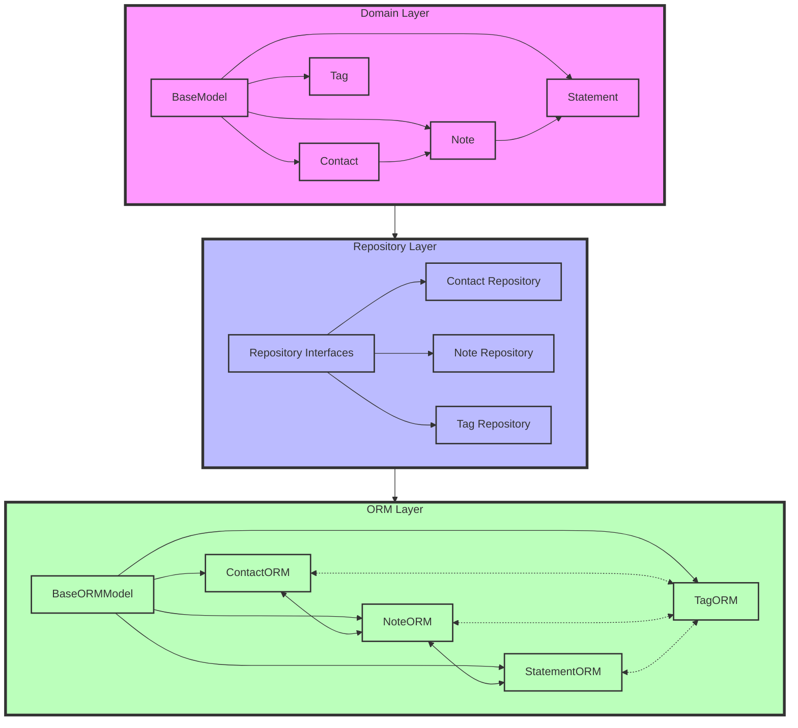

# Model Layer Design

> For implementation details and API reference, see [Model Layer Implementation](../../implementation/backend/MODEL_LAYER.md)

## Overview

This document explains the architectural decisions and design patterns used in the model layer of NeverEatAlone.

## File Organization

### Directory Structure
```
backend/app/models/
├── domain/                 # Domain models (business logic)
│   ├── __init__.py
│   ├── base.py            # BaseModel
│   ├── contact.py         # Contact domain model
│   ├── note.py           # Note and Statement models
│   └── tag.py            # Tag model and EntityType
│
├── orm/                   # ORM models (persistence)
│   ├── __init__.py
│   ├── base.py           # BaseORMModel
│   ├── contact.py        # ContactORM
│   ├── note.py          # NoteORM
│   ├── statement.py     # StatementORM
│   ├── tag.py           # TagORM
│   ├── contact_tag.py   # Association table
│   ├── note_tag.py      # Association table
│   └── statement_tag.py # Association table
│
└── repositories/          # Repository implementations
    ├── __init__.py
    ├── interfaces.py     # Repository protocols
    ├── sqlalchemy_contact_repository.py
    ├── sqlalchemy_note_repository.py
    └── sqlalchemy_tag_repository.py
```

### Component Dependencies


### Key Relationships
- Solid lines represent inheritance
- Dashed lines represent many-to-many relationships
- Solid arrows represent one-to-many relationships
- Each layer depends only on the layers above it
- Domain models have no knowledge of ORM or repositories
- Repositories translate between domain and ORM models

## Core Design Decisions

### 1. Domain-Driven Design
We chose DDD to ensure the codebase accurately reflects the business domain and rules:

- **Rich Domain Models**: Business logic lives in the domain models
- **Ubiquitous Language**: Code terminology matches business concepts
- **Bounded Contexts**: Clear separation between different parts of the system
- **Natural Domain Representation**: Domain models reflect business concepts naturally, without persistence implementation details

Example of rich domain model with business rules:
```python
class Tag:
    def set_frequency(self, days: Optional[int]) -> None:
        """Set contact frequency with validation."""
        if days is not None and not (1 <= days <= 365):
            raise ValueError("Frequency must be between 1 and 365 days")
        self.frequency_days = days
        self.last_contact = None if days is None else self.get_current_time()
```

Example of natural domain representation:
```python
class Note:
    def add_statement(self, content: str) -> None:
        """Add a statement to the note, maintaining natural list order."""
        statement = Statement(content)
        self.statements.append(statement)  # Order maintained by list position
```

### 2. Repository Pattern
We use repositories to abstract persistence details:

- **Interface-Based**: Repository interfaces define persistence contracts
- **Implementation-Agnostic**: Domain models don't know about storage
- **Single Responsibility**: Each repository handles one aggregate
- **Implementation Details Hidden**: Persistence mechanisms (like ordering) are managed by repositories

Example of repository interface:
```python
class TagRepository(Protocol):
    """Repository interface focused on domain operations."""
    def find_stale(self) -> List[Tag]:
        """Find tags that need attention based on frequency."""
        ...
```

Example of repository handling implementation details:
```python
class SQLAlchemyNoteRepository:
    def save(self, note: Note) -> Note:
        """Save note with statements, handling order persistence."""
        note_orm = NoteORM(...)
        for i, statement in enumerate(note.statements):
            # Repository layer manages sequence numbers
            statement_orm = StatementORM(
                content=statement.content,
                sequence_number=i
            )
            note_orm.statements.append(statement_orm)
        return note

### 3. Clean Architecture
Our layered approach ensures separation of concerns:

```
[Domain Models] → [Repository Interfaces] → [Repository Implementations] → [Database]
     ↑                    ↑                           ↑                        ↑
Business Logic     Persistence Contract      Storage Implementation     Actual Storage
```

Benefits:
- Domain logic is isolated from infrastructure
- Easy to test business rules
- Can change storage without affecting domain
- Clear dependencies between layers

### 4. Base Classes
We use base classes to share common functionality:

- **Domain Base**: Handles identity and timestamps
- **ORM Base**: Provides SQLAlchemy integration
- **Reduces Duplication**: Common patterns in one place
- **Consistent Behavior**: All entities handle basics the same way

### 5. Natural Keys and Relationships
Our relationship design prioritizes data integrity:

- **Natural Keys**: Tags use composite keys for uniqueness
- **Cascade Deletes**: Child records are removed with parents
- **Lazy Loading Control**: Explicit loading strategies
- **Bidirectional Navigation**: Easy to traverse relationships

Example of relationship configuration:
```python
class NoteORM(BaseORMModel):
    """ORM model with carefully chosen relationship settings."""
    statements = relationship(
        StatementORM,
        back_populates="note",
        cascade="all, delete-orphan",  # Automatic cleanup
        lazy="joined",                 # Performance optimization
        order_by="StatementORM.sequence_number"  # Consistent ordering
    )
```

## Testing Strategy

### 1. Pure Domain Tests
Testing business logic in isolation:
```python
def test_tag_validation():
    """Domain rules tested without infrastructure."""
    with pytest.raises(ValueError):
        Tag(entity_id=uuid4(), name="invalid")  # Must start with #
```

### 2. Repository Tests
Testing persistence with real database:
```python
def test_find_stale_tags(db_session: Session):
    """Full repository behavior tested."""
    repo = SQLAlchemyTagRepository(db_session)
    tag = create_stale_tag()
    repo.save(tag)
    assert len(repo.find_stale()) == 1
```

### 3. Test Infrastructure
Reliable test environment:
```python
@pytest.fixture(scope="session")
def db_session():
    """Isolated database testing."""
    engine = create_engine("sqlite:///:memory:")
    connection = engine.connect()
    transaction = connection.begin()
    session = Session(connection)
    yield session
    session.close()
    transaction.rollback()
```

## Performance Considerations

### 1. Lazy Loading
- Default to joined loading for common relationships
- Use lazy loading for rarely accessed data
- Explicit loading strategies in repository methods

### 2. Caching Opportunities
- Repository layer can add caching
- Natural keys enable efficient cache invalidation
- Session-level caching with SQLAlchemy

### 3. Transaction Management
- Repository methods handle transactions
- Consistent transaction boundaries
- Proper cleanup on failures

## Security Considerations

### 1. Input Validation
- Domain models validate all input
- Type hints enforce basic constraints
- Business rules checked in constructors

### 2. Data Access
- Repositories control data access
- No direct database access from higher layers
- Clear audit trail with timestamps

## Evolution and Maintenance

### 1. Adding Features
- Add methods to domain models for new behavior
- Extend repository interfaces for new queries
- Keep layers synchronized

### 2. Schema Changes
- Update ORM models first
- Migrate database schema
- Update domain models last

### 3. Testing Changes
- Start with domain model tests
- Add repository tests for new queries
- Update integration tests last
