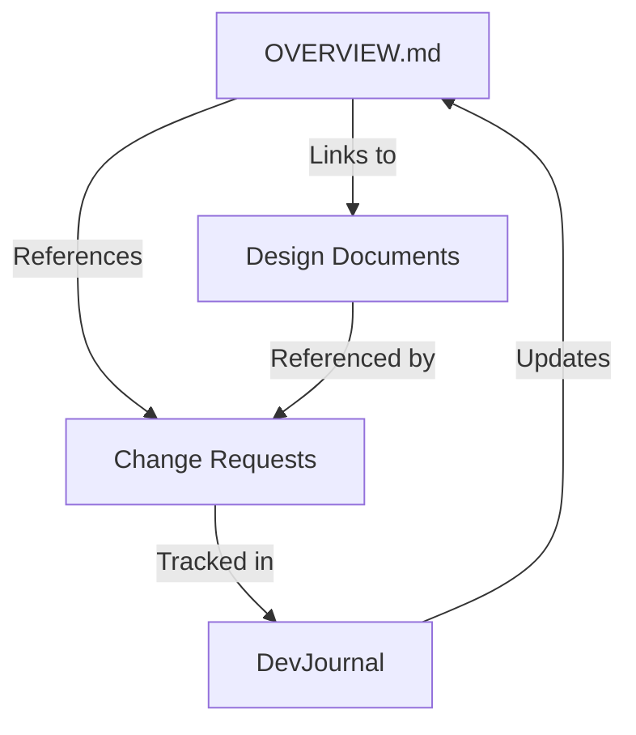

# Project Management Guide

## Project Structure
```
docs/
├── features/                # Feature documentation
│   ├── 1-data-model/       # First milestone
│   └── 2-service-layer/    # Second milestone
├── dev-journal/            # Development journals
│   └── sprint-YYYY-MM/     # Sprint journals
└── guides/                # Development guides
    ├── quick-start/       # Daily essentials
    └── detailed/         # In-depth docs
```

## Documentation Roles and Relationships

### Key Documents and Their Purposes

1. **Feature OVERVIEW.md**
   - **Purpose**: Living document showing complete feature scope
   - **Updates**: When feature scope/structure changes
   - **Content**:
     - Current status and progress
     - All components (both in-progress and planned)
     - High-level architecture
     - Documentation structure
     - Links to all related resources
   - **Think of it as**: Blueprint of the building

2. **Change Request (CR)**
   - **Purpose**: Specific change proposal and implementation plan
   - **Updates**: Fixed point-in-time, tracks implementation
   - **Content**:
     - Detailed requirements analysis
     - Impact analysis
     - Step-by-step implementation plan
     - Review points
     - Test plan
     - Version updates
   - **Think of it as**: Building permit application

3. **Development Journal**
   - **Purpose**: Daily/active progress log
   - **Updates**: Multiple times per day
   - **Content**:
     - Current sprint activities
     - Technical decisions as they happen
     - Learnings and insights (💡)
     - Future considerations (🔄)
     - Work-in-progress tracking
   - **Think of it as**: Construction site daily log

### When to Update What

1. **Starting New Work**
   - Check OVERVIEW.md for context
   - Create/update CR for implementation plan
   - Start DevJournal entries for progress

2. **During Implementation**
   - DevJournal: Daily progress and decisions
   - CR: Track implementation status
   - OVERVIEW.md: Update status and components if scope changes

3. **Completing Work**
   - CR: Mark as complete
   - OVERVIEW.md: Update status
   - DevJournal: Final entry with key learnings

### Document Relationships


## Feature Management

### Feature Lifecycle
1. **Planning**
   - Create feature directory
   - Create OVERVIEW.md
   - Plan initial CRs
   - Create design documents

2. **Implementation**
   - Create CRs in feature's crs/
   - Follow TDD process
   - Update documentation
   - Track in dev journal

3. **Completion**
   - Verify all CRs done
   - Update OVERVIEW.md
   - Archive documentation

## Change Request (CR) Process

### CR Structure
```
features/N-feature-name/
├── OVERVIEW.md           # Feature summary
├── design/              # Design decisions
└── crs/                # Change requests
    └── CR-YYYY.MM-N.md  # Individual CR
```

### CR Lifecycle
1. **Creation**
   - Create GitHub issue
   - Create CR document
   - Create feature branch
   - Update documentation

2. **Implementation**
   - Follow TDD process
   - Update CR status
   - Document decisions
   - Track progress

3. **Review**
   - Code review
   - Documentation review
   - Update CR status
   - Create PR

4. **Completion**
   - Merge PR
   - Finalize CR
   - Update documentation

## Development Journal

### Journal Types
1. **Sprint Journals**
   - Sprint overview
   - Feature progress
   - Technical decisions
   - Sprint learnings

2. **Feature Journals**
   - Implementation details
   - Technical decisions
   - Progress tracking
   - Future considerations

### Journal Structure
```
dev-journal/
├── sprint-YYYY-MM/
│   ├── DevJournal_Sprint-*.md    # Sprint overview
│   └── DevJournal_Feature-*.md   # Feature details
└── future-YYYY-QN/
    └── DevJournal_Future-*.md    # Future planning
```

## Best Practices

### Documentation
1. **Version Control**
   - Use YYYY.MM.DD-N format
   - Update all related docs
   - Keep history in each doc
   - Cross-reference changes

2. **Organization**
   - One CR per significant change
   - Clear feature boundaries
   - Consistent structure
   - Regular updates

3. **Progress Tracking**
   - Update journals daily
   - Track decisions
   - Document insights
   - Note future points

See `quick-start/` directory for day-to-day commands and workflows.
